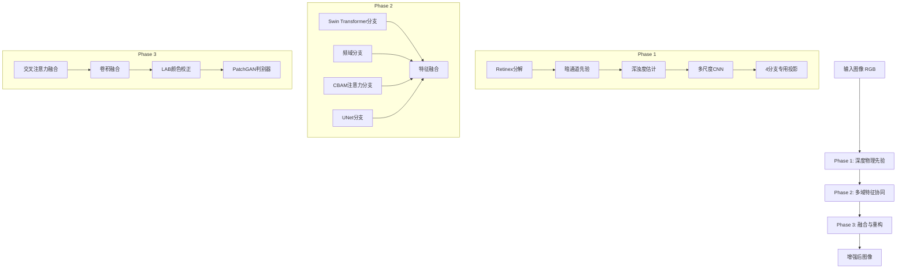

# UIENet 架构分析

## 整体架构图



## 数据流详解

### 输入
- **格式**: RGB图像
- **尺寸**: 可配置（默认384×384）
- **范围**: [-1, 1]（归一化后）

### Phase 1: 深度物理先验
1. **Retinex分解**: 将图像分解为光照(illumination)和反射(reflectance)分量
2. **暗通道先验**: 计算暗通道图，估计大气光值
3. **浑浊度估计**: 估计水下图像的浑浊度
4. **多尺度CNN**: 提取多尺度特征
5. **专用投影**: 生成4个分支的专用输入特征

**输出**: 
- `illumination`: 光照图
- `reflectance`: 反射图
- `turbidity`: 浑浊度图
- 4个分支的专用特征

### Phase 2: 多域特征协同
四个并行分支，每个分支接收Phase1的专用特征：

#### 1. Swin Transformer分支 (`branch_swin.py`)
- **功能**: 捕捉全局上下文信息
- **架构**: Swin Transformer块
- **参数**: 
  - `embed_dim`: 128
  - `window_size`: 8
  - `num_heads`: 4
  - `num_layers`: 6

#### 2. 频域分支 (`branch_freq.py`)
- **功能**: 处理频率域特征
- **架构**: FFT变换 + 频域卷积
- **参数**:
  - `mid_channels`: 128
  - `input_size`: [384, 384]

#### 3. CBAM注意力分支 (`branch_cbam.py`)
- **功能**: 通道和空间注意力机制
- **架构**: CBAM模块
- **参数**:
  - `reduction`: 16
  - `spatial_kernel`: 7

#### 4. UNet分支 (`branch_unet.py`)
- **功能**: 多尺度特征融合
- **架构**: UNet编码器-解码器
- **参数**:
  - `base_channels`: 128
  - `input_size`: [384, 384]

**输出**:
- `fa`: Swin Transformer特征
- `fb`: 频域特征
- `fc`: CBAM特征
- `fd`: UNet特征
- `pred_b_mid`: 频域分支中间监督图
- `pred_d_mid`: UNet分支中间监督图

### Phase 3: 融合与重构
1. **交叉注意力融合**: 融合四个分支的特征
2. **卷积融合**: 进一步融合特征
3. **LAB颜色校正**: 在LAB颜色空间进行校正
4. **PatchGAN判别器**: 对抗训练

**输出**: 增强后的图像

## 损失函数

### 总损失 (`losses/total_loss.py`)
包含多个损失项：
1. **重建损失**: L1/L2损失
2. **感知损失**: 基于VGG特征
3. **频域损失**: 频域差异
4. **梯度损失**: 边缘保持
5. **对抗损失**: GAN损失
6. **中间监督损失**: Phase2的中间输出

### 判别器损失
- **R1梯度惩罚**: 稳定GAN训练
- **PatchGAN损失**: 局部判别

## 训练策略

### 优化器
- **生成器**: Adam优化器
- **判别器**: Adam优化器（不同学习率）

### 学习率调度
- **Warmup**: 初始学习率预热
- **CosineAnnealing**: 余弦退火调度

### 训练技巧
- **梯度累积**: 等效大batch size
- **EMA**: 指数移动平均提升泛化
- **数据增强**: 随机裁剪、翻转、颜色抖动

## 模型配置

所有超参数在 `config.yaml` 中配置，包括：

### 网络结构参数
- `in_channels`: 输入通道数 (3)
- `num_classes`: 输出通道数 (3)
- `phase1_*`: Phase1相关参数
- `branch_swin`: Swin Transformer参数
- `branch_freq`: 频域分支参数
- `branch_cbam`: CBAM参数
- `branch_unet`: UNet参数
- `phase3`: Phase3参数
- `discriminator`: 判别器参数

### 数据参数
- `data.train_size`: 训练图像尺寸
- `data.normalize_mean/std`: 归一化参数
- `data.*_prob`: 数据增强概率

### 训练参数
- `train.batch_size`: 批大小
- `train.lr`: 学习率
- `train.epochs`: 训练轮数
- `train.lambda_*`: 各损失权重

## 性能指标

### 定量指标
- **PSNR**: 峰值信噪比（目标28dB+）
- **SSIM**: 结构相似性指数
- **UIQM**: 水下图像质量指标

### 定性指标
- 视觉质量提升
- 颜色保真度
- 细节保持

## 代码结构

```
UIENet/
├── config.yaml          # 配置文件
├── train.py             # 训练脚本
├── test.py              # 测试脚本
├── data/                # 数据处理
├── models/              # 模型定义
│   ├── uienet.py        # 主模型
│   ├── phase1.py        # Phase1实现
│   ├── phase2_module.py # Phase2模块
│   ├── phase2/          # Phase2分支
│   │   ├── branch_swin.py
│   │   ├── branch_freq.py
│   │   ├── branch_cbam.py
│   │   └── branch_unet.py
│   ├── phase3.py        # Phase3实现
│   └── discriminator.py # 判别器
├── losses/              # 损失函数
└── utils/               # 工具函数
```

## 扩展点

### 1. 添加新分支
在 `models/phase2/` 中添加新的分支模块，并在 `phase2_module.py` 中集成。

### 2. 修改损失函数
在 `losses/total_loss.py` 中添加新的损失项。

### 3. 调整架构
修改 `config.yaml` 中的参数，或直接修改模型代码。

### 4. 支持新数据集
在 `data/datasets.py` 中添加新的数据集类。

## 调试与测试

### 测试脚本
- `test.py`: 正式测试
- `test_bugs.py`: 调试测试

### 日志
- TensorBoard日志: `logs/`
- 训练日志: `train.log`

## 部署

### 模型导出
1. 加载训练好的模型权重
2. 使用TorchScript或ONNX导出
3. 集成到应用中

### 推理优化
1. 模型量化
2. 图优化
3. 批量推理

## 参考文献

1. Swin Transformer: Liu et al., 2021
2. CBAM: Woo et al., 2018
3. PatchGAN: Isola et al., 2017
4. Retinex理论: Land, 1971
5. 暗通道先验: He et al., 2010

## 联系方式

如有架构相关问题，请通过GitHub Issues联系。